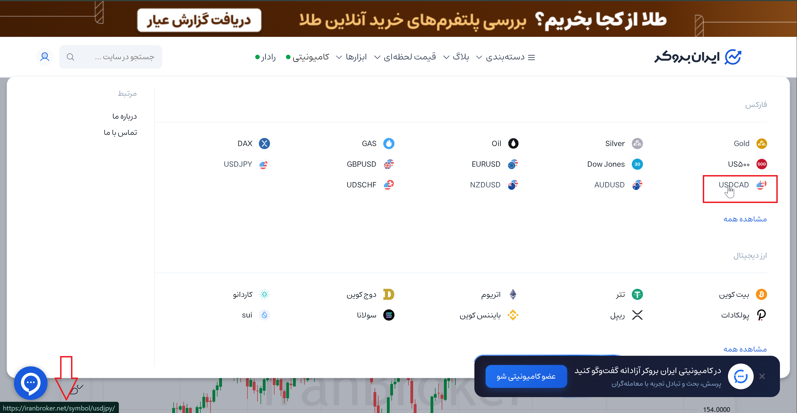

# Bug Report: USDCAD button redirects to USDJPY chart

## General Information
| Item | Details |
|---|---|
| **Bug ID** | BUG-001-IRANBROKER |  
| **Severity** | High |  
| **Priority** | High |  

## Environment
| Environment | Details |
|---|---|
| **OS** | Windows 10 |
| **Browser** | Chrome |
| **Device** | Desktop |

## Steps to Reproduce
1. Open iranbroker.net
2. Hover over "قیمت لحظه‌ای" on navbar
3. Hover over the **USDCAD** button (do not click)
4. Check the browser status bar at the bottom of the page
5. Click on the **USDCAD** button

## Expected Result
1. Before click: Browser status bar should show a URL containing `.../USDCAD`
2. After click: The **USDCAD** chart should load

## Actual Result
1. Before click: Browser status bar shows a URL containing `.../USDJPY`
2. After click: The **USDJPY** chart loads instead

## Attachments

## Note
Before clicking, browser status bar already shows the link points to USDJPY, so the issue is a wrong link, not a chart loading problem.
