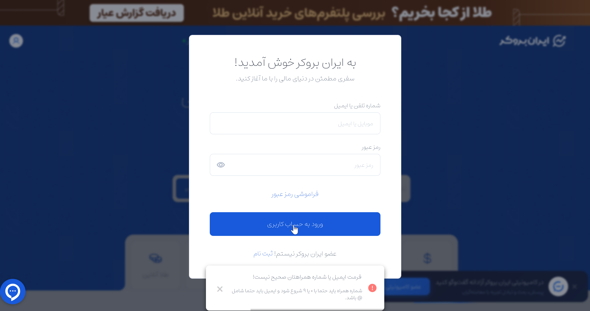

# Bug Report: Incorrect validation message displayed when login fields are empty

## General Information
| Item | Details |
|---|---|
| **Bug ID** | BUG-002-IRANBROKER |  
| **Severity** | Low |  
| **Priority** | Medium |  

## Environment
| Environment | Details |
|---|---|
| **OS** | Windows 10 |
| **Browser** | Firefox |
| **Device** | Desktop |

## Steps to Reproduce
1. Open iranbroker.net
2. Click on login logo
3. Do not enter anything on username and password field.
4. Click on "ورود به حساب کاربری"

## Expected Result
- An error message should be displayed indicating that username and password are required.

## Actual Result
- An error message was displayed: "فرمت ایمیل یا شماره همراهتان صحیح نیست"

## Attachments

